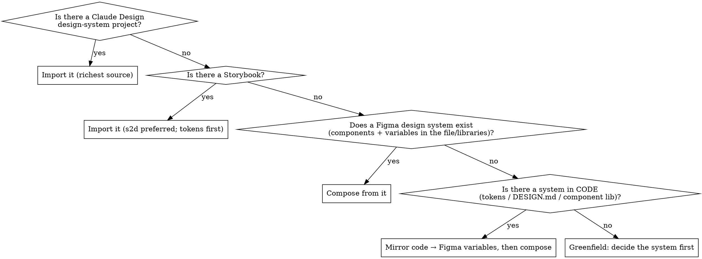

# Designing in Figma

## The core insight

Claude's HTML/CSS design output is strong because the `frontend-design` workflow
**forces a committed aesthetic direction and drives each design dimension as a named
decision before generating.** Authoring into Figma usually falls off not because Figma
is harder, but because that workflow gets skipped — Claude jumps straight to drawing
nodes, pixel-pushes instead of thinking in auto-layout, draws primitives instead of
composing from a system, and never renders-and-critiques.

**The fix: run the same aesthetic engine, anchor it to a `DESIGN.md` token contract,
and execute with `figma-use` discipline.** The aesthetic decisions are medium-independent
— this skill is the conductor that lands them as native Figma (auto-layout frames, bound
variables, component instances) instead of DOM/CSS.

```
quality = committed aesthetic direction   (frontend-design engine)
        + a token contract               (DESIGN.md → Figma variables)
        + auto-layout + components        (figma-use discipline)
        + render → critique → fix loop    (screenshot self-correction)
```

**REQUIRED SUB-SKILLS — load these, do not duplicate them.** Figma serves 12 skills live from
[figma/mcp-server-guide](https://github.com/figma/mcp-server-guide/tree/main/skills); they are
beta and change. **Delegate to them** (load the skill, and pass `skillNames` on every
`use_figma` call) rather than copying their text here, or this skill drifts against them.

| Load | When |
|---|---|
| `figma-use` | **MANDATORY before any `use_figma` call.** The definitive authoring rule set (auto-layout, FILL/HUG, font loading, variable binding, gotchas). Always first. |
| `frontend-design` | The aesthetic engine (Step 1). Load it to make the design decisions; this skill does not restate its taste rules. |
| `figma-generate-library` | Design-system / component-library work. Carries the 5-phase gate — see Step 5. |
| `figma-generate-design` | A single screen or page translated into Figma. |
| `figma-create-new-file` | Bootstrapping an empty target file. |
| `figma-code-connect` | Mapping finished Figma components back to code components. |
| `figma-design-to-code` | The reverse direction — not this skill. |
| `figma-use-figjam` / `figma-use-slides` / `figma-generate-diagram` | Non-Design-file surfaces. |
| `figma-implement-motion` / `figma-use-motion` / `figma-swiftui` | Motion and SwiftUI specialisations. |

Note `skillNames` is a **logging** parameter — it does not gate execution. Actually loading
`figma-use` is what prevents the failures.

**Preflight:** every write tool (`use_figma`, `generate_figma_design`, `create_new_file`,
`upload_assets`, `get_libraries`, `search_design_system`) is **remote-server only**. The
local/desktop Figma MCP server cannot write. Confirm with `whoami` before planning any build;
if it fails, stop and tell the user to switch to the remote server.

## When to use

- The user wants a design/screen/UI/mockup/component **created in Figma** (code-to-design).
- Figma output has been reading as generic, flat, or "AI slop" vs. Claude's HTML work.
- You're about to call `use_figma` to build something visual from intent or code.

**When NOT to use:** pulling existing Figma → code (design-to-code; use `get_design_context`).
Pure token export with no authoring. Editing a single existing node's text.

## Step 0 — Branch on the starting point

Detect the situation FIRST, because it changes the order of operations.



| Branch | How to detect | What to do |
|---|---|---|
| **D. Claude Design project** | The user names one, or `DesignSync list_projects` returns a writable design-system project | **Highest-fidelity source — prefer it over B.** It ships CSS-custom-property tokens, a `.d.ts` component API, a group taxonomy, and standalone renders. Full contract: `references/claude-design-import.md`. |
| **E. Storybook** | `.storybook/` exists, or a `storybook` dep, or a served `/index.json` | **Prefer the story.to.design plugin over the MCP write path** — code stays the single source of truth and re-syncs on one click; reconstructing components by hand creates drift. Tokens first, then atomics → composites. Full contract: `references/storybook-import.md`. |
| **A. Existing Figma system** | `get_libraries` shows subscribed libraries; `search_design_system` returns components/variables; the target file already has variable collections | Discover assets first; **compose from real component instances and bind existing variables.** Don't invent tokens that already exist. The aesthetic is largely dictated — match it. |
| **B. System in code only** | Repo has design tokens, a `DESIGN.md`, Tailwind theme, or a component library; Figma file is empty | Locate or generate a `DESIGN.md` from the code tokens → **materialize it as Figma variables** → then compose. See `references/design-md-template.md`. |
| **C. Greenfield** | No system anywhere | **Run the aesthetic engine to DECIDE the system, write a `DESIGN.md`, materialize variables + a small component kit, THEN build screens.** This ordering matters — see the trap below. |

Branches stack: D, E or B gives you the tokens, A tells you what already exists in Figma so you
don't duplicate it. Always run the Step 3 discovery pass even when you arrive with tokens.

**The greenfield trap:** the Figma authoring skills bias toward "match existing
conventions." With no conventions to match, that bias pulls output straight back to the
generic center. So in Branch C you MUST commit an aesthetic direction and lay down the
token/component layer *before* composing screens — otherwise you get clean structure with
slop aesthetics.

## The workflow

Create a TodoWrite item for each step.

1. **Commit the aesthetic direction** (Branch B/C; skip when Branch A, D or E already dictates
   it — an imported system *is* the direction, so match it rather than re-deciding).
   Load `frontend-design` and run its engine: pick ONE bold, intentional direction; drive
   type / color / motion / space / background as named decisions; explicitly name the
   generic defaults to avoid (Inter, purple-on-white, even palettes). State the choice
   before building. This is the single highest-leverage step.

2. **Establish the token contract.** Branch D: read the Claude Design project
   (`references/claude-design-import.md`) — its `_ds_manifest.json` `tokens[]` array is a
   token export already done for you. Branch E: find the Storybook's token source and read
   `globalTypes` / `addon-themes` for the mode list (`references/storybook-import.md`).
   Branch A: discover existing variables. Branch B:
   load/convert the code's `DESIGN.md`. Branch C: author a new `DESIGN.md` from the Step-1
   decisions. Template + Figma-targeting guidance: `references/design-md-template.md`.
   If a `DESIGN.md` exists, `npx @google/design.md lint DESIGN.md` to catch broken refs and
   WCAG contrast issues before they become variables. **For an MCP-only run, materialize the
   tokens directly in Step 4 — you do NOT need the `export --format dtcg` step.** That export
   is only for the alternate route (importing `tokens.json` into Figma via a Variables plugin
   like Tokens Studio); skip it unless you're deliberately taking that route.

3. **Load `figma-use`, then discover what already exists — always, every run.**
   `whoami` → `create_new_file` if needed, or use the provided file key. Then
   **`get_libraries` → `search_design_system`** (scope with `includeLibraryKeys`) *before
   creating anything.* Reuse is not the default behaviour: left alone the agent hardcodes
   colors/spacing/typography and ignores a linked library, and it will happily draw plain
   frames beside correct instances in the same run. Discovery is not optional even in
   Branch C — check before you invent.

4. **Materialize tokens → Figma variables** (Branch B/C/D/E). Create the collections for
   palette / type scale / spacing / radii. Per `figma-use`: set **explicit scopes**
   (never leave `ALL_SCOPES`), **rename modes** (never `Mode 1`), bind colors via
   `setBoundVariableForPaint` and spacing/radii via `setBoundVariable`.
   **Set code syntax on every variable:**

   ```js
   v.setVariableCodeSyntax('WEB', `var(--color-bg-primary)`)   // var() wrapper required
   ```

   Use the **actual variable name from the codebase**, not a name derived from the Figma
   variable. ANDROID/iOS take no wrapper. This is a **one-way Dev Mode annotation, not a live
   round-trip** — nothing reads it back into code. Its value is that Dev Mode shows the real
   token name instead of one guessed from the Figma variable name, which is what stops the
   two sides drifting under human maintenance.

   Variables resolve to four types only — `BOOLEAN | COLOR | FLOAT | STRING`. So:
   **gradients** (`setBoundVariableForPaint` is SOLID-only) → paint styles; **shadows** →
   effect styles; **`clamp()`/`vh`/`vw`** → resolve to a fixed px value per breakpoint mode,
   or skip and say so. `fontSize` **is** bindable via `setBoundVariable` (verified); treat
   `fontWeight`/`lineHeight` as unverified and check before relying on either.
   Two more traps: Figma **rejects `.` in variable names** (`spacing/1.5` throws — sanitize to
   `spacing/1-5`), and CSS `rem` values must be **converted to px** before becoming FLOATs.

   The Variables **REST API is Enterprise-only, reads and writes alike** — assume the Plugin
   API / MCP write path.

5. **Discover or create components** for repeated elements. Branch A: instantiate existing
   ones. Branch B/C/D/E: build real components, or use `figma-generate-library`.

   **If this is design-system work, it is never one-shot.** `figma-generate-library` mandates
   20–100+ small `use_figma` calls across five gated phases — 0 Discovery (get user approval)
   → 1 Foundations (collections, modes, primitives, semantics, scopes, code syntax) →
   2 File Structure → 3 Components **one at a time, never batched** → 4 Code Connect + QA.
   Do not advance a phase until the current one's acceptance checks pass. **Variables before
   components — no token, no component.** Keep mutations on one file sequential; parallel
   writes race on Figma state.

   Branch D shortcut: the `.d.ts` files already specify the variant axes — string union →
   VARIANT, boolean → BOOLEAN property, string → TEXT, `ReactNode` → INSTANCE_SWAP. Use them
   instead of inventing a component API. Branch E: same mapping, but read **`argType.options`
   first** — hand-authored argTypes put the values there with `type.name === 'string'`, and
   only docgen-inferred ones set `type.name === 'enum'`. Both occur in the same Storybook.
   When `s2d.variantProperties` exists it is authoritative — don't derive axes from every
   available `options` array.

   **Enforce a variant budget: ≤ ~30 per component.** The matrix is the *product* of the axes,
   so `theme(2) × variant(6) × size(6)` is 72 before you add states. Over budget: keep the
   primary axis as VARIANT, demote the rest to BOOLEAN/TEXT properties or separate stories.
   State the matrix size before building and say what you dropped.

6. **Build incrementally — this is where most Figma output breaks.** See the mapping in
   `references/html-to-figma-mapping.md`. Rules that matter most:
   - Wrapper frame in its OWN `use_figma` call; return its ID. Build each section *inside*
     it in a separate call (building top-level then reparenting silently orphans nodes).
   - **Think in auto-layout, never pixel-push.** Any structurally-related children go in an
     auto-layout frame (= flexbox tree). Absolute `x/y` is the rare exception, as in good CSS.
   - Set `FILL`/`HUG` sizing **after** `appendChild`. `resize()` resets sizing to FIXED — call it first.
   - `loadFontAsync` → await → mutate text → return IDs. Distinctive (non-Inter) fonts throw
     "unloaded font" if you skip this — and those are exactly the fonts the aesthetic wants.
   - Bind variables/styles; instantiate components; set text via `setProperties` after font load.
   - ≤10 logical ops per call; batch imports with `Promise.all`; `return` every node ID
     (`console.log` is invisible).
   - **Images:** the Plugin API cannot fetch external image URLs. If the source is a web view
     with images, run `generate_figma_design` against the *same* `fileKey` in parallel to
     capture it, copy `imageHash` values off the capture onto your built frames, then delete
     the capture — skip this and image frames come out blank. If instead you have the image
     files locally (Branch D's `assets/`), just use `upload_assets`; no capture needed.

7. **Screenshot self-correction loop** after each section. Call `await node.screenshot()`
   (inline) or `get_screenshot`, and look specifically for: clipped/cropped text, overlap,
   leftover placeholder text, wrong component variants. Write a **targeted** fix to the
   offending node — do not regenerate. Pair `get_metadata` (structure) with the screenshot
   (visual). This is the render → critique → refine loop, and Figma does it well because
   fixes ripple through variables/instances instead of patching pixels.

8. **Final pass — check against explicit exit criteria, not vibes.** `get_metadata` +
   `get_screenshot` of the whole thing. It is NOT done until all of these hold:
   - Reads as the committed Step-1 direction, not the generic center (clean ≠ distinctive).
   - Dramatic type scale survived (the display↔body contrast didn't get flattened).
   - Accent color used for ~one primary action per screen; no sharp/rounded corner mixing;
     ≤2 font weights per screen.
   - Every color/spacing/radius resolves to a **bound variable** — zero stray hex/px.
   - Every variable carries **code syntax** matching the real codebase token name.
   - Repeated elements are **component instances**, not redrawn primitives.
   - Auto-layout holds if text lengths change; no clipped text, overlap, or placeholders.
   - WCAG AA contrast holds (4.5:1 body, 3:1 large/UI) — especially text on accent fills.
   If any fail, fix and re-screenshot before claiming done.

9. **Hand back explicitly — the pipeline does not fully automate.** Write-to-canvas is beta
   and its output needs human review. Tell the user plainly: what you built, what is
   placeholder, and that **they must publish the library in the Figma UI before Code Connect
   can complete** — publishing is a UI action with no REST equivalent. (Code Connect
   *mapping* publication can be automated via the `code-connect` CLI; the library publish
   itself cannot.) Do not claim the system is live until that click has happened.

## Common task patterns

Things real screens force that the core loop doesn't spell out:

- **Aligned tables / comparison grids** (the hardest Figma structure). Build column-first:
  one auto-layout column frame per column, each holding its cells; align cells by giving every
  cell in a row the same fixed height and `FILL` width within the column. Or use a single
  `layoutMode:'GRID'` frame. Do NOT build row-by-row with absolute x — columns drift. Bind row
  height and gaps to spacing variables so the grid stays rhythmic.
- **Responsive / multiple breakpoints.** If the brief implies mobile + desktop, author **one
  top-level frame per breakpoint** (e.g. 1440 and 390), each built by the same workflow. Encode
  breakpoint differences as a variable **mode** only if they're pure token swaps; structural
  layout differences (stacked vs. row) need separate frames. Mind the plan mode limit
  (Free 1, Pro 4). State up front which breakpoints you're producing.
- **Copy / content.** If the user didn't supply copy, write realistic, specific placeholder
  content (real plan names, prices, feature lines) — never lorem ipsum, and never "Plan A /
  Plan B." Flag in your summary that copy is placeholder so the user can replace it.
- **Exploring directions.** The "commit to ONE direction" rule is about not averaging *within*
  a design. If the user wants options, produce 2–3 *separately committed* directions as
  distinct frames — each internally consistent — not one hedged mashup.

## Red flags — STOP

| If you catch yourself… | Do this instead |
|---|---|
| Calling `use_figma` before loading `figma-use` | Load `figma-use` first. Always. It prevents hard-to-debug failures. |
| Creating a component without first running `search_design_system` | Discover, then build. Reuse is never the default — check every run. |
| Creating variables without `setVariableCodeSyntax` | Set it, using the real codebase token name. Otherwise the library can't round-trip. |
| Building components before the variable collections exist | Variables first. No token, no component. |
| Batching a whole component library into a few big calls | 20–100+ small calls, one component at a time, phase-gated. |
| A Claude Design project exists and you're reading its `.zip` | Use `DesignSync list_files`/`get_file` — the zip drops the component API and token index. |
| Expecting `index.json` to give you a Storybook's props | It carries identity only. Run a second docgen/iframe pass. |
| Reading only `argType.type` for variant values | Read `options` first — hand-authored argTypes leave `type.name` as `'string'` and put the axis in `options`. |
| Importing Storybook components before the token phase | Tokens first, or fills arrive as raw hex. |
| Importing a composite before the atomics it contains | Children must exist first or nesting flattens instead of linking. |
| Building a variant set over ~30 cells | Demote axes to BOOLEAN/TEXT properties. The matrix is a product; it explodes. |
| Hand-building Figma components from a Storybook you could have s2d'd | s2d keeps code the source of truth and re-syncs on a click. Reconstruction drifts. |
| Building a Branch-C screen with no aesthetic direction committed | Stop. Run the `frontend-design` engine first (Step 1). |
| Setting absolute `x`/`y` on related elements | Use an auto-layout frame. Pixel coords break on resize and read as AI slop. |
| Hardcoding hex / px / font names in nodes | Bind variables / styles. Raw literals = inline-styled spaghetti. |
| Drawing rectangles + text for a button that exists as a component | Instantiate the component. Compose, don't redraw. |
| Building the whole screen in one giant `use_figma` call | One section per call, ≤10 ops, wrapper first. Keeps errors recoverable. |
| Skipping the screenshot after a section | Screenshot and check for clipped text / overlap / placeholders before moving on. |
| "It's structurally fine, ship it" without checking aesthetics | Run the final pass against the committed direction. Clean ≠ distinctive. |

## Why this works

Un-directed, Claude converges to the on-distribution center (the "AI slop" aesthetic).
The aesthetic engine forces a single committed point of view; the `DESIGN.md` makes those
decisions a portable, lint-able contract; `figma-use` discipline keeps the execution clean
(auto-layout, bound variables, component instances); and the screenshot loop catches
execution defects. The quality lives in the **workflow**, not in any single generator —
which is exactly why it's a skill.

## References

- `references/claude-design-import.md` — **Branch D.** Claude Design project shapes, the
  `_ds_manifest.json` token index, `.d.ts` → Figma component-property mapping, and the
  round-trip back through `DesignSync`.
- `references/storybook-import.md` — **Branch E.** The story.to.design authoring contract
  (`s2d.variantProperties`, pseudo-states, special args), the tokens-first phase and its
  colors-only/styles-not-variables ceiling, atomics → composites import order and nesting
  rules, `index.json` limits, `options`-first axis extraction, and the MCP fallback.
- `references/design-md-template.md` — Figma-optimized `DESIGN.md` template (Google's real
  spec + Figma-targeting affordances) and how to feed it to the model.
- `references/html-to-figma-mapping.md` — flexbox→auto-layout, CSS-vars→variables,
  component→instance mapping table for `use_figma` authoring, with the load-bearing gotchas.
