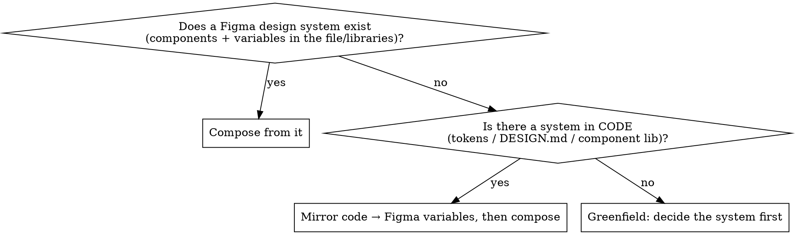

# Designing in Figma

## The core insight

Claude's HTML/CSS design output is strong because the `frontend-design` workflow
**forces a committed aesthetic direction and drives each design dimension as a named
decision before generating.** Authoring into Figma usually falls off not because Figma
is harder, but because that workflow gets skipped — Claude jumps straight to drawing
nodes, pixel-pushes instead of thinking in auto-layout, draws primitives instead of
composing from a system, and never renders-and-critiques.

**The fix: run the same aesthetic engine, anchor it to a `DESIGN.md` token contract,
and execute with `figma-use` discipline.** The aesthetic decisions are medium-independent
— this skill is the conductor that lands them as native Figma (auto-layout frames, bound
variables, component instances) instead of DOM/CSS.

```
quality = committed aesthetic direction   (frontend-design engine)
        + a token contract               (DESIGN.md → Figma variables)
        + auto-layout + components        (figma-use discipline)
        + render → critique → fix loop    (screenshot self-correction)
```

**REQUIRED SUB-SKILLS — load these, do not duplicate them:**
- `figma-use` — MANDATORY before any `use_figma` call. The definitive authoring rule set
  (auto-layout, FILL/HUG, font loading, variable binding, gotchas). Always load first.
- `frontend-design` — the aesthetic engine (Step 1 below). Load it to make the design
  decisions; this skill does not restate its taste rules.
- `figma-generate-library` — when you must create a component/variable library from scratch.

## When to use

- The user wants a design/screen/UI/mockup/component **created in Figma** (code-to-design).
- Figma output has been reading as generic, flat, or "AI slop" vs. Claude's HTML work.
- You're about to call `use_figma` to build something visual from intent or code.

**When NOT to use:** pulling existing Figma → code (design-to-code; use `get_design_context`).
Pure token export with no authoring. Editing a single existing node's text.

## Step 0 — Branch on the starting point

Detect the situation FIRST, because it changes the order of operations.



| Branch | How to detect | What to do |
|---|---|---|
| **A. Existing Figma system** | `get_libraries` shows subscribed libraries; `search_design_system` returns components/variables; the target file already has variable collections | Discover assets first; **compose from real component instances and bind existing variables.** Don't invent tokens that already exist. The aesthetic is largely dictated — match it. |
| **B. System in code only** | Repo has design tokens, a `DESIGN.md`, Tailwind theme, or a component library; Figma file is empty | Locate or generate a `DESIGN.md` from the code tokens → **materialize it as Figma variables** → then compose. See `references/design-md-template.md`. |
| **C. Greenfield** | No system anywhere | **Run the aesthetic engine to DECIDE the system, write a `DESIGN.md`, materialize variables + a small component kit, THEN build screens.** This ordering matters — see the trap below. |

**The greenfield trap:** the Figma authoring skills bias toward "match existing
conventions." With no conventions to match, that bias pulls output straight back to the
generic center. So in Branch C you MUST commit an aesthetic direction and lay down the
token/component layer *before* composing screens — otherwise you get clean structure with
slop aesthetics.

## The workflow

Create a TodoWrite item for each step.

1. **Commit the aesthetic direction** (Branch B/C; skip if Branch A dictates it).
   Load `frontend-design` and run its engine: pick ONE bold, intentional direction; drive
   type / color / motion / space / background as named decisions; explicitly name the
   generic defaults to avoid (Inter, purple-on-white, even palettes). State the choice
   before building. This is the single highest-leverage step.

2. **Establish the token contract.** Branch A: discover existing variables. Branch B:
   load/convert the code's `DESIGN.md`. Branch C: author a new `DESIGN.md` from the Step-1
   decisions. Template + Figma-targeting guidance: `references/design-md-template.md`.
   If a `DESIGN.md` exists, `npx @google/design.md lint DESIGN.md` to catch broken refs and
   WCAG contrast issues before they become variables. **For an MCP-only run, materialize the
   tokens directly in Step 4 — you do NOT need the `export --format dtcg` step.** That export
   is only for the alternate route (importing `tokens.json` into Figma via a Variables plugin
   like Tokens Studio); skip it unless you're deliberately taking that route.

3. **Load `figma-use`** (mandatory) and get the target file. `whoami` →
   `create_new_file` if needed, or use the provided file key. Inspect the file before writing.

4. **Materialize tokens → Figma variables** (Branch B/C). Create the variable collection
   for palette / type scale / spacing / radii. Per `figma-use`: set **explicit scopes**
   (never leave `ALL_SCOPES`), **rename modes** (never `Mode 1`), bind colors via
   `setBoundVariableForPaint` and spacing/radii via `setBoundVariable`.

5. **Discover or create components** for repeated elements. Branch A: instantiate existing
   ones. Branch B/C: build a minimal kit (button, input, card, …) as real components, or
   use `figma-generate-library`. Composition from components is what keeps screens consistent.

6. **Build incrementally — this is where most Figma output breaks.** See the mapping in
   `references/html-to-figma-mapping.md`. Rules that matter most:
   - Wrapper frame in its OWN `use_figma` call; return its ID. Build each section *inside*
     it in a separate call (building top-level then reparenting silently orphans nodes).
   - **Think in auto-layout, never pixel-push.** Any structurally-related children go in an
     auto-layout frame (= flexbox tree). Absolute `x/y` is the rare exception, as in good CSS.
   - Set `FILL`/`HUG` sizing **after** `appendChild`. `resize()` resets sizing to FIXED — call it first.
   - `loadFontAsync` → await → mutate text → return IDs. Distinctive (non-Inter) fonts throw
     "unloaded font" if you skip this — and those are exactly the fonts the aesthetic wants.
   - Bind variables/styles; instantiate components; set text via `setProperties` after font load.
   - ≤10 logical ops per call; batch imports with `Promise.all`; `return` every node ID
     (`console.log` is invisible).

7. **Screenshot self-correction loop** after each section. Call `await node.screenshot()`
   (inline) or `get_screenshot`, and look specifically for: clipped/cropped text, overlap,
   leftover placeholder text, wrong component variants. Write a **targeted** fix to the
   offending node — do not regenerate. Pair `get_metadata` (structure) with the screenshot
   (visual). This is the render → critique → refine loop, and Figma does it well because
   fixes ripple through variables/instances instead of patching pixels.

8. **Final pass — check against explicit exit criteria, not vibes.** `get_metadata` +
   `get_screenshot` of the whole thing. It is NOT done until all of these hold:
   - Reads as the committed Step-1 direction, not the generic center (clean ≠ distinctive).
   - Dramatic type scale survived (the display↔body contrast didn't get flattened).
   - Accent color used for ~one primary action per screen; no sharp/rounded corner mixing;
     ≤2 font weights per screen.
   - Every color/spacing/radius resolves to a **bound variable** — zero stray hex/px.
   - Repeated elements are **component instances**, not redrawn primitives.
   - Auto-layout holds if text lengths change; no clipped text, overlap, or placeholders.
   - WCAG AA contrast holds (4.5:1 body, 3:1 large/UI) — especially text on accent fills.
   If any fail, fix and re-screenshot before claiming done.

## Common task patterns

Things real screens force that the core loop doesn't spell out:

- **Aligned tables / comparison grids** (the hardest Figma structure). Build column-first:
  one auto-layout column frame per column, each holding its cells; align cells by giving every
  cell in a row the same fixed height and `FILL` width within the column. Or use a single
  `layoutMode:'GRID'` frame. Do NOT build row-by-row with absolute x — columns drift. Bind row
  height and gaps to spacing variables so the grid stays rhythmic.
- **Responsive / multiple breakpoints.** If the brief implies mobile + desktop, author **one
  top-level frame per breakpoint** (e.g. 1440 and 390), each built by the same workflow. Encode
  breakpoint differences as a variable **mode** only if they're pure token swaps; structural
  layout differences (stacked vs. row) need separate frames. Mind the plan mode limit
  (Free 1, Pro 4). State up front which breakpoints you're producing.
- **Copy / content.** If the user didn't supply copy, write realistic, specific placeholder
  content (real plan names, prices, feature lines) — never lorem ipsum, and never "Plan A /
  Plan B." Flag in your summary that copy is placeholder so the user can replace it.
- **Exploring directions.** The "commit to ONE direction" rule is about not averaging *within*
  a design. If the user wants options, produce 2–3 *separately committed* directions as
  distinct frames — each internally consistent — not one hedged mashup.

## Red flags — STOP

| If you catch yourself… | Do this instead |
|---|---|
| Calling `use_figma` before loading `figma-use` | Load `figma-use` first. Always. It prevents hard-to-debug failures. |
| Building a Branch-C screen with no aesthetic direction committed | Stop. Run the `frontend-design` engine first (Step 1). |
| Setting absolute `x`/`y` on related elements | Use an auto-layout frame. Pixel coords break on resize and read as AI slop. |
| Hardcoding hex / px / font names in nodes | Bind variables / styles. Raw literals = inline-styled spaghetti. |
| Drawing rectangles + text for a button that exists as a component | Instantiate the component. Compose, don't redraw. |
| Building the whole screen in one giant `use_figma` call | One section per call, ≤10 ops, wrapper first. Keeps errors recoverable. |
| Skipping the screenshot after a section | Screenshot and check for clipped text / overlap / placeholders before moving on. |
| "It's structurally fine, ship it" without checking aesthetics | Run the final pass against the committed direction. Clean ≠ distinctive. |

## Why this works

Un-directed, Claude converges to the on-distribution center (the "AI slop" aesthetic).
The aesthetic engine forces a single committed point of view; the `DESIGN.md` makes those
decisions a portable, lint-able contract; `figma-use` discipline keeps the execution clean
(auto-layout, bound variables, component instances); and the screenshot loop catches
execution defects. The quality lives in the **workflow**, not in any single generator —
which is exactly why it's a skill.

## References

- `references/design-md-template.md` — Figma-optimized `DESIGN.md` template (Google's real
  spec + Figma-targeting affordances) and how to feed it to the model.
- `references/html-to-figma-mapping.md` — flexbox→auto-layout, CSS-vars→variables,
  component→instance mapping table for `use_figma` authoring, with the load-bearing gotchas.
